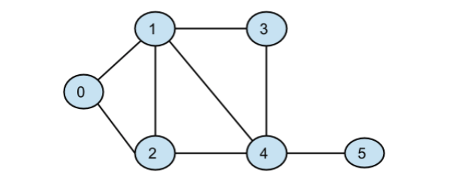

# Overview

Use NS3 simulator to simulate a given topology, then use routing algorithms to print its tables, and modify the routing algorithm to keep only one path.

---
# Topology Requested

---
# Note
For example of outputs, please check the associated pdf file.